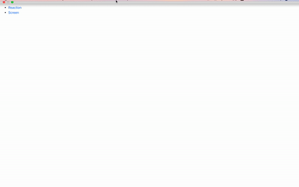

## Available Scripts

In the project directory, you can run:

### `npm start`

Runs the app in the development mode. 
Open [http://localhost:3000](http://localhost:3000) to view it in the browser.

The page will reload if you make edits. 
You will also see any lint errors in the console.

## Open a Browser Tab

Click the route and navigate to Reaction.

## Open another Browser Tab

Click the route and navigate to Screen.

## Adjustment on Contants.js File

[Mandatory] Set your CurrentIP to {URL} (command: ifconfig for terminal)

[Optional] Adjust {PORT} Number (Please be consistant to the PORT from interactive_screen_server)

[NoChangeRequired] {NAMESPACE}

